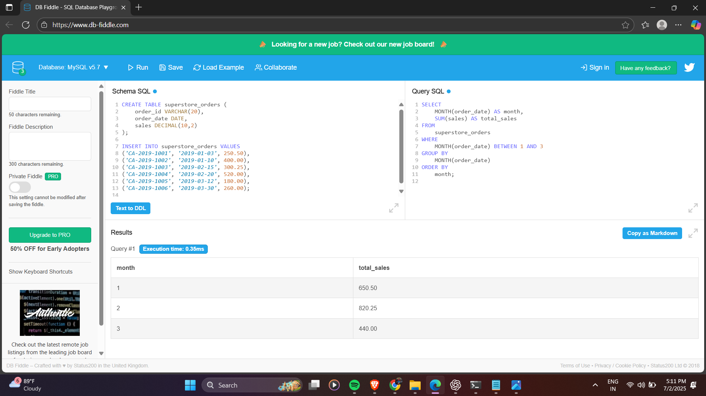

# 📊 SQL for Sales Trend Analysis – Task 6

## 🧠 Objective

The goal of this task is to analyze monthly revenue and order volume using SQL aggregation techniques. This includes writing queries using functions like `SUM()`, `COUNT()`, date-based grouping, and sorting.

---

## 🧰 Tools Used

- 🛠 MySQL (via db-fiddle.com)  
- 💻 Notepad (for writing and saving `.sql` file)  
- 🖼 Screenshot Tool (for capturing query outputs)  
- 🌐 GitHub (for submission)  

---

## 🔍 SQL Concepts Used

- `SELECT`, `ORDER BY`, `GROUP BY`
- Aggregate functions: `SUM()`, `COUNT()`, `AVG()`
- `YEAR()`, `MONTH()` for date grouping
- `LIMIT`, `WHERE` clause
- `COALESCE()` for handling NULLs

---

## 📜 Queries Executed

1. Create table and insert sample data  
2. Monthly revenue and total order volume  
3. Top 3 months by revenue  
4. Sales trend in year 2019  
5. Sales between January and March (Q1)  
6. Handling NULL values in sales  
👉 All queries are saved in: `task6_queries.sql`

---

## 📸 Screenshots

Each query output screenshot is displayed below:

### 🟩 Query 1: Monthly Revenue and Order Volume  

### 🟦 Query 2: Top 3 Months by Revenue  

### 🟨 Query 3: 2019 Monthly Sales Trend  

### 🟧 Query 4: Q1 (Jan–Mar) Sales  

### 🟫 Query 5: NULL Handling in Sales  

---

## 🚀 How to Run

1. Go to [https://www.db-fiddle.com](https://www.db-fiddle.com)  
2. Paste table creation + insert + queries in Schema SQL and Query SQL  
3. Run each query one by one  
4. Capture output as screenshots  
5. Save all queries into `task6_queries.sql`  
6. Upload everything to GitHub with screenshots and this README

---

## ✅ Outcome

This task helped in learning how to group, aggregate, and analyze time-based trends using SQL. It built confidence in using real-world functions like `YEAR()`, `MONTH()`, `SUM()`, `COUNT(DISTINCT)` and interpreting business data.

---

## ✨ Author

**Name:** Avnish Bedi  
**Course:** B.Tech IT, 2nd Year  
**Internship:** Elevate Labs - Data Analyst  
